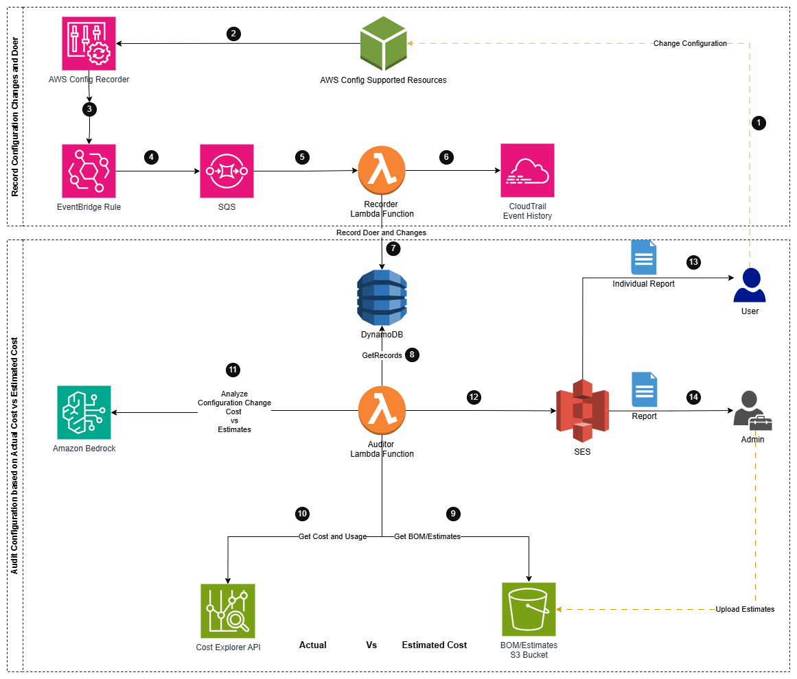
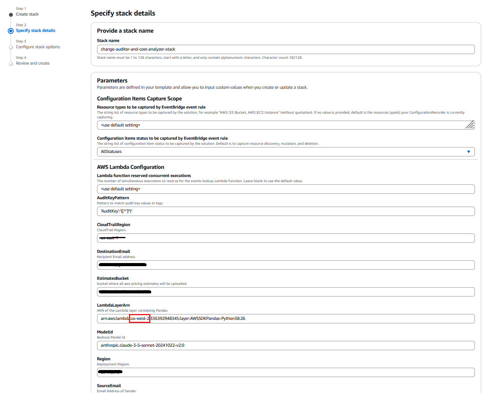
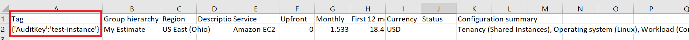
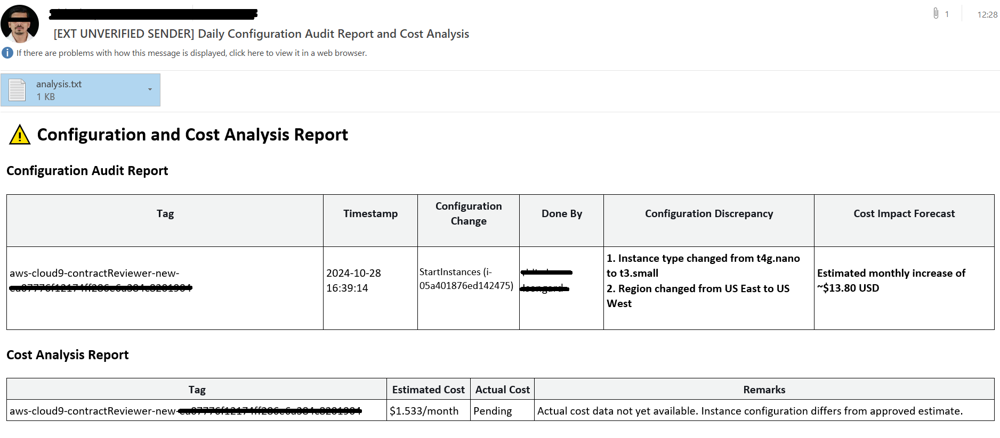
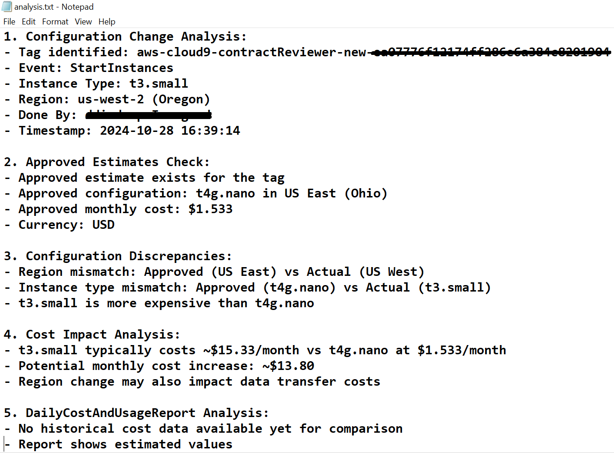

# Prevent Cost Overruns Using GenAI for Configuration Change Analysis

## Overview

The AWS Configuration Change Auditor and Cost Analyzer is a comprehensive solution designed to address the common challenge of unexpected cloud cost increases. It provides automated auditing, reporting, and AI-powered analysis of AWS configuration changes, helping organizations track costs, identify deviations from approved estimates, and promote a culture of cost optimization.

## Challange

Organizations frequently encounter situations where actual AWS costs surpass initial estimates. This often leads to time-consuming investigations to determine the cause of increased costs. In most cases, it is discovered that users have changed configurations or increased usage beyond initial estimates, but identifying these changes can take weeks or even months, potentially leading to distrust between customers, partners, and AWS.

## Solution

This solution automates the process of tracking configuration changes, analyzing their cost impact, and generating insightful reports. By leveraging AWS services and AI capabilities, it provides timely insights into who made changes, what was changed, and the potential cost implications.

## Key Features

1. Real-time tracking of AWS configuration changes
2. User-specific change attribution
3. Comparison of configuration changes with approved estimates
4. Integration with AWS Cost Explorer for actual cost data
5. AI-powered analysis using Amazon Bedrock and Anthropic's Claude model
6. Automated daily reporting for individual users and administrators
7. Promotion of cost-aware practices within the organization

## Architecture



### Components

1. **AWS Config Recorder**: Tracks configuration changes across supported AWS resources.
2. **EventBridge Rule**: Triggers on configuration change events.
3. **SQS Queue**: Buffers change events for processing.
4. **Recorder Lambda Function**: Processes change events and stores details in DynamoDB.
5. **CloudTrail**: Provides additional context on who made changes.
6. **DynamoDB**: Stores configuration change records.
7. **Auditor Lambda Function**: Analyzes changes, retrieves cost data, and generates reports.
8. **Amazon Bedrock**: Provides AI-powered analysis of configuration changes and cost impacts.
9. **Cost Explorer API**: Retrieves actual cost data based on resource tags.
10. **BOM/Estimates S3 Bucket**: Stores approved cost estimates for comparison.
11. **Amazon SES**: Sends email reports to users and administrators.

## Workflow

1. AWS Config records configuration changes in supported resources.
2. EventBridge rules trigger on these changes, sending events to an SQS queue.
3. The Recorder Lambda function processes these events, storing details in DynamoDB.
4. Every 24 hours, the Auditor Lambda function runs, performing the following tasks:
   a. Retrieves configuration changes from DynamoDB
   b. Fetches actual cost data from Cost Explorer API
   c. Compares changes with approved estimates from the S3 bucket
   d. Uses Amazon Bedrock to analyze the impact of changes
   e. Generates reports for individual users and administrators
5. Amazon SES sends out the generated reports via email.

## Prerequisites
- AWS account with appropriate permissions on Bedrock model
- All AWS Resources should be taged with AuditKey example {'AuditKey':'test-instance'}
- All resources in Estimates csv files should have respective Tags in first column

## Deployment

1. Clone the **genai-based-aws-configuration-change-auditor-and-cost-analyzer** github repository to your computer using the following command:
    ```
    git clone https://github.com/aws-samples/genai-based-aws-configuration-change-auditor-and-cost-analyzer
    ```

2. Configure the [AWS credential keys](https://docs.aws.amazon.com/cli/latest/userguide/cli-configure-quickstart.html) to authenticate and authorize the AWS CLI commands on your account.

3. Verify an email identity in Amazon SES. This is the email address that you will use as sender:
    ```
    aws ses verify-email-identity --email-address <Your email address>
    ```
    After issuing this command, you should recive an email for the verification request. You will need to click on the URL link to confirm that you are authorized to use this email address.


4. Navigate to AWS CloudFormation console
3. Click "Create stack" > "With new resources"
4. Upload the template file /cfn_templates/self_contained_template.yml
5. Configure the following parameters:

### Parameter Details



1. **Configuration Items Capture Scope**
   - Defines which AWS resource types will be captured by EventBridge event rule
   - Use default settings or specify custom resource types

2. **Configuration Items Status**
   - Set to "AllStatuses" to capture all configuration changes
   - Controls which status changes will be monitored

3. **AWS Lambda Configuration**
   - Controls concurrent executions for the Lambda function
   - Leave blank for default values

4. **AuditKeyPattern**
   - Pattern to match audit key values in tags. You have to specify same Tag Name in all AWS pricing estimates in csv format
   - Default: "AuditKey-*{[*]}"

5. **CloudTrailRegion**
   - Specify the region where CloudTrail logs will be collected

6. **DestinationEmail**
   - Email address where notifications will be sent
   - Must be a valid email address

7. **EstimatesBucket**
   - S3 bucket name where AWS pricing estimates will be stored
   - Must be a unique bucket name

8. **LambdaLayerArn**
   - ARN of the Lambda layer containing Pandas
   - Format: arn:aws:lambda:[region]:[account]:layer:[layer-name]

9. **ModelId**
    - Bedrock Model ID
    - Default: anthropic.claude-3-sonnet-20240229-v1:0

10. **Region**
    - AWS region where resources will be .deployed

11. **SourceEmail**
    - Sender email address for notifications


## Post-Deployment
- Verify all resources are created correctly
- Confirm email subscriptions if any
- Add First Column in csv file having estimates generated by AWS Pricing Calculator
- Add Tag Name and Value for each resource in csv file. example {'AuditKey':'test-instance'} 
- Test the configuration by making changes to monitored resources



## Usage

Once deployed, the solution operates automatically:

1. Configuration changes are continuously monitored and recorded.
2. Individual users receive daily reports detailing their changes and potential cost impacts.
3. Administrators receive comprehensive daily reports of all changes across the organization.
4. Reports highlight deviations from approved estimates and actual costs.

# Sample Output



The email includes:

- AI-generated Cost analysis
- Actionable recommendations
- Potential impact assessment
- Attachment **analysis.txt** contains detailed Analysis to backtrack assessment




## Customization

The solution can be customized in several ways:

1. Adjust the Bedrock prompts in the Auditor Lambda function to focus on specific types of insights.
2. Modify the CustomInstructions parameter in CloudFormation Template for customized analysis.

## FAQ

Q1: How accurate is the AI-powered analysis?

A1: The analysis leverages Amazon Bedrock and Anthropic's Claude model, which provides high-quality insights based on the data provided. However, it's important to review the AI-generated recommendations in the context of your specific use case and organizational policies.

Q2: Can this solution be used across multiple AWS accounts?

A2: Yes, the solution can be deployed in a multi-account setup using AWS Organizations and a central auditing account. Some modifications to the architecture may be required.

Q3: How far back does the solution analyze configuration changes?

A3: By default, the solution analyzes changes from the past 48 hours. This can be adjusted in the Auditor Lambda function to cover a longer period if needed.

Q4: What types of AWS resources are supported for change tracking?

A4: The solution supports all AWS resources that are compatible with AWS Config. This covers a wide range of services, but you should verify coverage for any specific resources you're interested in tracking.

Q5: Can the solution integrate with other notification systems besides email?

A5: While the current implementation uses Amazon SES for email notifications, the Auditor Lambda function can be modified to integrate with other notification systems like Slack, Microsoft Teams, or custom webhooks.

Q6: How does this solution handle cost allocation for shared resources?

A6: The solution relies on proper tagging of resources for accurate cost allocation. Ensure that your tagging strategy aligns with your cost allocation needs for best results.


## Security

See [CONTRIBUTING](CONTRIBUTING.md#security-issue-notifications) for more information.

## License

This library is licensed under the MIT-0 License. See the LICENSE file.
